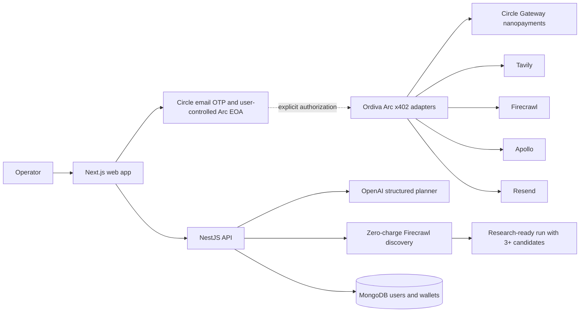

# Ordiva

> Your agent spends well, and you can see why.

Ordiva is an agentic supplier-sourcing platform built for the **Agentic Economy** track of the Arc Hackathon. A user gives the agent a real-world procurement goal and a USDC budget, and grants that budget once. The agent then plans the work, discovers supplier candidates, and **buys evidence about each one with real USDC nanopayments on Arc — signed by its own wallet, with no human present.** Every purchase exposes its reason, policy result, price, and settlement receipt.

The central idea is simple: **the model provides judgment; deterministic code controls authority**.

## The problem

AI agents can search, reason, and recommend, but purchasing data safely is still unresolved.

A sourcing operator normally has to coordinate search providers, website scrapers, company-enrichment services, contact discovery, and email tools. Giving an LLM unrestricted access to those services creates a different problem: fetched content is untrusted, costs are difficult to explain, and a prompt-injected model must never be able to move funds by itself.

Circle already provides the user-controlled wallet infrastructure. Ordiva adds the missing buying layer:

- which service is worth paying for;
- whether the returned evidence is useful;
- when to retry, switch providers, or stop;
- whether the remaining budget is worth spending;
- and a human-readable record of every economic decision.

## The demo

The primary demonstration goal is:

> Find at least three industrial-pump suppliers in Rotterdam, verify that they are real companies, and prepare a request for quotation for each. Budget: 2 USDC.

The current run flow:

1. The user signs in with an email OTP through Circle and receives one user-controlled EOA on Arc Testnet.
2. Ordiva provisions the user's **agent wallet** — an Arc EOA it operates on their behalf.
3. The user grants a budget **once**, moving USDC from their own wallet into the agent's Circle Gateway balance. This is the only human act in the money path.
4. The user enters a sourcing outcome and service budget.
5. OpenAI generates a constrained, schema-validated research plan.
6. Ordiva executes multiple Firecrawl discovery queries at zero wallet charge.
7. Results are normalized and deduplicated by supplier domain, capped at the requested candidate count.
8. **The agent buys evidence for each candidate** — scrape, company enrichment, contact discovery — paying per call from its own escrowed balance, unattended.
9. The workbench shows the live spend meter and a decision ledger: every purchase, its reason, price, outcome, and settlement reference.
10. Verified suppliers with public contacts receive persisted RFQ drafts.
11. The operator reviews the exact recipient, subject, and body; approval is bound to that draft's SHA-256 hash and invalidated by any edit.
12. The agent buys the Resend delivery through the same budget-gated x402 rail and records both the email receipt and Arc settlement.

Public-web discovery is explicitly reported as a **zero-wallet-charge step**. Email delivery is not claimed until the corresponding authorization and receipt exist.

## Why this belongs in the Agentic Economy

Ordiva is not a chat wrapper around a search API. Its complete product loop is shaped around economic decisions:

- the agent receives a goal rather than a single query;
- it decomposes that goal into research and evidence requirements;
- it can choose between paid capabilities with different prices and expected value;
- it operates inside a user-defined USDC budget;
- it can adapt when a provider fails or evidence is weak;
- and it can decide when the job is complete.

The current MVP connects planning, discovery, paid verification, exact-draft outreach approval, and Resend delivery through the Arc x402 seller rail. The LLM may recommend useful work, but it never authorizes payment or email: deterministic code validates the network, service, seller, schema, budget, recipient syntax, and approved content hash before execution.

## Why Arc

Agentic workloads create many small service purchases. Conventional onchain settlement is a poor fit when each API call may cost only a few cents or fractions of a cent.

Ordiva uses Arc Testnet and Circle Gateway nanopayments because the payment rail supports:

- USDC-native settlement;
- offchain EIP-3009 authorizations;
- gas-free individual service requests;
- batched onchain settlement;
- HTTP `402 Payment Required` negotiation;
- and receipts that can be associated with the agent's decision record.

Arc is not a decorative chain choice in Ordiva. It is the settlement network accepted by every x402 adapter route.

## Verified nanopayment proof

Measured on Arc Testnet, 6 August 2026, using the product's own code paths.

| Measurement | Result |
|---|---:|
| Payments settled by the agent | `60` across two runs |
| Agent Gateway balance | `$10.000000` → `$9.540000` |
| One 10-candidate run | 30 payments, `$0.21` of a `$2.00` budget |
| Smallest payment | `$0.005000` |
| Gas paid by the agent | `$0.00` |
| Gas paid by the user, one-time funding | `$0.00367` |
| Human interactions while spending | `0` |

Every purchase returned a distinct Circle Gateway settlement reference and a SHA-256 hash
of the response. Balances are read back from Circle's Gateway API rather than the
`availableBalance` view on the Gateway contract — x402 payments are off-chain
authorisations settled in batches, so the contract view lags by a whole batch and would
report a spend meter frozen at the deposit amount.

## Why this needs Arc

A run moves `$0.0675` of value across nine service calls. The individual purchases are
half a cent to a cent each — below the point where conventional onchain settlement makes
any sense.

| | Ordiva on Arc | Nine ordinary L1 transfers |
|---|---:|---:|
| Value moved | `$0.0675` | `$0.0675` |
| Gas paid by the agent | `$0.00` | 9 × gas |
| Onchain transactions by the agent | `0` | `9` |

The agent's payments are **EIP-3009 authorisations signed off-chain** and batch-settled by
Circle Gateway, so it pays no gas and writes to the chain zero times. The only gas in the
whole flow is the user's one-time funding deposit: **`$0.00367`, measured**.

Assume a conservative `$0.05` per transfer on a conventional L1 — a figure that has been
far higher in practice. Nine settlements would cost `$0.45`, or **6.7× the value being
moved**. The economics do not merely get worse; they invert. An agent that must pay more in
gas than the data costs cannot make fine-grained purchasing decisions at all, which is
precisely the judgment Ordiva exists to exercise. USDC-denominated gas and batched Gateway
settlement are what make per-call buying viable.

## Architecture



Two paths, now connected:

1. **The run path** plans, performs zero-wallet-charge discovery, then buys evidence for each candidate through the paid rail.
2. **The paid service rail** exposes conventional APIs behind Arc-only x402 endpoints with pre-payment validation and normalized receipts.

The bridge between them is the agent wallet: an Ordiva-operated Arc EOA, funded by its own user, that signs each payment. Ordiva does not use a shared platform buyer wallet and does not fund anyone's agent.

## Judgment and authority

| Decision | Owner | Current state |
|---|---|---|
| Decompose the sourcing goal | LLM | Implemented |
| Generate discovery and evidence requirements | LLM | Implemented |
| Choose which evidence to buy per candidate | Deterministic code | Implemented |
| Enforce the Arc network | Deterministic code | Implemented, before signing |
| Enforce allowed services and sellers | Deterministic code | Implemented, before signing |
| Enforce the budget and exact price | Deterministic code | Implemented, before signing |
| Stop when the budget is exhausted | Deterministic code | Implemented |
| Validate request and response schemas | Deterministic code | Implemented |
| Authorize email recipients and content | Deterministic code plus explicit user approval | Implemented with versioned content hashes |

The budget gate runs **before any signature exists**, so a refused purchase leaves no
authorisation behind. Every refusal is recorded on the run with its reason — what the agent
declined to buy is part of the record, not an omission from it.

Fetched pages are treated as evidence, never instructions. The model receives bounded content and returns constrained structured output.

## Arc x402 adapter catalog

Ordiva wraps conventional APIs in a consistent, discoverable payment interface.

### Core API surface

| Route | Purpose |
|---|---|
| `GET /healthz` | API and Arc-network health check |
| `GET /v1/auth/config` | Public Circle application and required wallet configuration |
| `POST /v1/auth/email/start` | Start the Circle email-OTP flow |
| `POST /v1/auth/session` | Validate the Circle user token and create an Ordiva session |
| `GET /v1/auth/me` | Return the authenticated user and public Arc wallet |
| `POST /v1/runs/plan` | Generate a plan, discover candidates, and persist the run |
| `GET /v1/runs` | List the caller's runs |
| `GET /v1/runs/:runId` | Return one run with its full purchase ledger |
| `POST /v1/runs/:runId/verify` | Buy evidence for every candidate, unattended |
| `GET /v1/agent-wallet` | Agent address and live Gateway spending balance |
| `POST /v1/agent-wallet/fund/approve` | Challenge permitting the Gateway to move USDC |
| `POST /v1/agent-wallet/fund/deposit` | Challenge crediting the agent's Gateway balance |
| `GET /v1/catalog` | Return the Arc adapter catalog, prices, availability, and schemas |

Account and sourcing routes are enabled only when their required environment variables are configured. The adapter catalog remains available so missing upstream configuration is visible rather than silently ignored.

### Paid adapter routes

| Route | Capability | Upstream | Default price |
|---|---|---|---:|
| `POST /v1/suppliers/tavily-search` | Supplier search | Tavily | `$0.01` |
| `POST /v1/suppliers/firecrawl-search` | Supplier search | Firecrawl | `$0.01` |
| `POST /v1/evidence/firecrawl-scrape` | Company evidence | Firecrawl | `$0.005` |
| `POST /v1/company/apollo-enrich` | Company enrichment | Apollo | `$0.0075` |
| `POST /v1/contacts/firecrawl-extract` | Public contact discovery | Firecrawl | `$0.01` |
| `POST /v1/email/resend-send` | Allowlisted email delivery | Resend | `$0.01` |

`GET /v1/catalog` is free. It returns the network, seller address, configured availability, prices, and JSON Schemas for every adapter.

Paid adapter responses include:

- the disclosed upstream provider;
- verified payer, amount, network, and Gateway settlement reference;
- normalized response data;
- request latency;
- and a SHA-256 hash of the response.

Unavailable services, malformed inputs, unsafe scrape targets, and disallowed email recipients fail before the x402 payment middleware.

## Authentication and wallet model

Ordiva is a multi-user product. Each account has **two Arc EOAs with distinct roles**:

| Wallet | Custody | Role |
|---|---|---|
| User wallet | Circle **user**-controlled — the user holds the keys | Identity, and funding the agent |
| Agent wallet | Circle **developer**-controlled — Ordiva operates it | Signs the agent's payments |

Both must be EOAs. EIP-3009 `TransferWithAuthorization` is verified with `ecrecover`, which
a smart-contract account cannot satisfy.

Authentication works as follows:

1. The browser initializes Circle's Web SDK.
2. The API requests an email OTP challenge.
3. Circle's secure UI verifies the OTP.
4. The API validates the returned Circle user token.
5. Circle returns or creates one Arc EOA for the user.
6. Ordiva issues its own application session.

Ordiva stores the Circle user ID and public wallet metadata. It does **not** store the OTP, Circle user token, encryption key, PIN, key shares, or private key.

### Granting spending authority

The user moves USDC from their own wallet into their agent's Gateway balance: `approve` on
USDC, then `depositFor` on the Gateway contract, both PIN-approved through Circle's
challenge flow. That is the single human act in the money path. Afterwards the agent signs
every payment itself, and the escrowed balance is a **physical ceiling** — it cannot spend
more than was deposited, whatever else goes wrong.

**The honest tradeoff:** the agent wallet is operated by Ordiva, so moving USDC into it is
a step down from self-custody to escrow with Ordiva as operator. Only the run budget is ever
moved, never a standing balance. Returning unspent budget to the user's wallet is
outstanding work and must ship before this is production-ready.

This is **not** bring-your-own-agent. Ordiva provisions the agent wallet; the user brings
the budget, not the keys.

## Safety properties

- Arc Testnet is the only accepted x402 network.
- The model receives no payment or email tools.
- Request validation and safety preflight run before payment.
- Metered upstream execution is an explicit opt-in independent of `NODE_ENV`.
- Scraping rejects private, loopback, and local network targets.
- Email accepts any syntactically valid recipient entered in the reviewed draft.
- Resend requests require an idempotency key.
- A paid upstream failure retains its payment receipt.
- One user wallet and one agent wallet are enforced per user.
- The agent can only spend what its user escrowed; the balance is a physical ceiling.
- The budget gate runs before any signature exists, so a refused purchase leaves no reusable authorisation.
- Refused and failed purchases are recorded with their reasons, not discarded.
- Supplier candidates remain labeled unverified until evidence exists.
- The UI never claims payment, verification, settlement, or email delivery without proof.

## Technology

| Layer | Technology |
|---|---|
| Web | Next.js App Router, React, Tailwind CSS, Zustand |
| API | NestJS, TypeScript, Zod |
| Agent planning | OpenAI Responses API through the Vercel AI SDK |
| Authentication | Circle User-Controlled Wallets and email OTP |
| Payments | Arc Testnet, USDC, x402, Circle Gateway nanopayments |
| Persistence | MongoDB with Mongoose |
| Upstreams | Tavily, Firecrawl, Apollo, Resend |
| Tooling | pnpm workspaces, Vitest, ESLint |

## Repository

```text
ordiva/
├── api/                    NestJS API, agent orchestration, wallets and adapters
│   ├── src/
│   │   ├── adapters/       Arc x402 seller routes and conventional upstreams
│   │   ├── auth/           Circle email OTP and Ordiva sessions
│   │   ├── sourcing/       Planning and supplier discovery
│   │   ├── users/          User persistence
│   │   └── wallets/        One-wallet-per-user records
│   └── test/               API integration tests
├── web/                    Next.js operator interface
│   └── src/
│       ├── app/            App Router pages
│       ├── components/     Authentication, goal and run interfaces
│       └── lib/            API, session and run state
├── package.json            Workspace scripts
└── pnpm-workspace.yaml
```

Package-specific navigation:

- [API folder guide](./api/README.md)
- [Web folder guide](./web/README.md)

## Local development

### Prerequisites

- Node.js 22
- pnpm 10
- a MongoDB database
- Circle Developer credentials configured for User-Controlled Wallets
- an OpenAI API key
- at least a Firecrawl key for autonomous supplier discovery

Tavily, Apollo, and Resend are optional for running the initial discovery flow. Their adapter routes report unavailable before payment when their credentials are missing.

### Install

```bash
pnpm install
cp api/.env.example api/.env
```

Fill the required values in `api/.env`. Never commit that file.

Metered conventional upstream calls are disabled by default. To deliberately use OpenAI, Firecrawl, Tavily, Apollo, or Resend credits in any environment, including development, set:

```bash
ORDIVA_UPSTREAM_MODE=live
```

With `ORDIVA_UPSTREAM_MODE=disabled`, sourcing and adapter responses use deterministic demo fixtures without consuming OpenAI, Firecrawl, Tavily, Apollo, or Resend credits. The x402 adapter boundary remains visible so payment-policy behavior can still be exercised. Set `live` only when real upstream execution and settlement are intended.

### Run

Start the API:

```bash
pnpm dev:api
```

In another terminal, start the web app:

```bash
pnpm dev:web
```

Open `http://localhost:3000`. The web app proxies `/api/backend/*` to the API at `http://localhost:4100` by default.

To use a different API origin, set `ORDIVA_API_URL` for the web process.

## Environment variables

| Variable | Required for | Purpose |
|---|---|---|
| `ORDIVA_UPSTREAM_MODE` | Metered calls | `disabled` by default; set to `live` to explicitly allow metered upstream execution in any environment |
| `MONGODB_URI` | Accounts | MongoDB connection |
| `AUTH_JWT_SECRET` | Accounts | Signs Ordiva sessions |
| `CIRCLE_API_KEY` | Accounts | Circle developer API access |
| `CIRCLE_APP_ID` | Accounts | Circle Web SDK application |
| `CIRCLE_ENTITY_SECRET` | Agent wallets | Authorises developer-controlled wallet operations. Back up with its recovery file — losing both permanently disables agent wallets for the account |
| `CIRCLE_WALLET_SET_ID` | Agent wallets | Wallet set holding the agent wallets |
| `ARC_RPC_URL` | Agent wallets | Arc Testnet RPC, for owner balance and allowance reads |
| `USDC_ADDRESS` | Agent wallets | USDC token on Arc |
| `GATEWAY_WALLET_ADDRESS` | Agent wallets | Circle Gateway escrow contract |
| `ORDIVA_SELF_URL` | Verification | Where the API reaches its own paid adapter routes |
| `OPENAI_API_KEY` | Sourcing | Structured plan generation |
| `OPENAI_MODEL` | Optional | Overrides the configured OpenAI model |
| `FIRECRAWL_API_KEY` | Sourcing | Autonomous supplier discovery and evidence |
| `ARC_ADAPTER_SELLER_ADDRESS` | Adapters | Receives Arc Gateway nanopayments |
| `CIRCLE_GATEWAY_FACILITATOR_URL` | Adapters | Verifies Gateway payment authorizations |
| `TAVILY_API_KEY` | Optional adapter | Alternate supplier search |
| `APOLLO_API_KEY` | Optional adapter | Company enrichment |
| `RESEND_API_KEY` | Optional adapter | Email delivery |
| `RESEND_FROM_EMAIL` | Email | Verified sender identity |
| `PRICE_*` | Adapter pricing | Per-route USDC prices such as `$0.02` |

See [`api/.env.example`](./api/.env.example) for the complete configuration contract.

## Commands

All JavaScript workspace operations use pnpm.

| Command | Purpose |
|---|---|
| `pnpm dev:api` | Start the NestJS API in watch mode |
| `pnpm dev:web` | Start the Next.js development server |
| `pnpm typecheck` | Type-check the API, tests, and web app |
| `pnpm lint` | Run API and web linting |
| `pnpm test` | Run the API test suite |
| `pnpm build` | Create production API and web builds |

## Verification status

The current repository passes:

- TypeScript type-checking;
- ESLint;
- 78 API tests;
- the NestJS production build;
- and the Next.js production build on Node.js 22.

Alongside the original coverage — Circle authentication boundaries, one-wallet enforcement, adapter validation, Arc-only 402 challenges, normalized provider responses, supplier deduplication, email validation, idempotency, and paid upstream failure receipts — the tests now cover the payment path itself:

- the agent signer's typed-data handling, including the `EIP712Domain` entry Circle requires and the `bigint` serialisation the batching SDK forces;
- rejection of any signature that is not 65-byte ECDSA, so a smart-contract account fails loudly rather than at the facilitator;
- the budget gate refusing on budget, adapter, and network grounds **before a signature exists**;
- funding challenge ordering, and that `approve` targets the USDC token while `depositFor` targets the Gateway;
- the verification loop's spend accumulation, decline handling, evidence extraction, and candidate cap.

## Current MVP boundary

### Implemented

- Circle email-OTP accounts, with one user wallet and one agent wallet per user
- user-funded agent Gateway balance via `approve` + `depositFor`
- **agent-signed Arc x402 payments** — 60 settled in live testing
- deterministic budget gate, enforced before signing
- MongoDB sourcing runs with a complete purchase ledger, ownership enforced
- OpenAI structured sourcing plans and autonomous Firecrawl discovery
- paid evidence verification per candidate: scrape, enrichment, contact discovery
- six Arc-only x402 seller routes, all priced at or below `$0.01`
- operator workbench with a live spend meter and decision ledger
- valid-recipient, idempotent Resend adapter

### Next

- return unspent budget from the agent's Gateway balance to the user's wallet
- create run-connected email drafts and approval records
- send only after recipient-level approval

This boundary is intentional and visible in the product. Ordiva does not present zero-charge discovery as an onchain purchase, and it names its custody tradeoff rather than implying the agent wallet is self-custodied.

## License

This project was created for the Arc Hackathon. A production license has not yet been selected.
