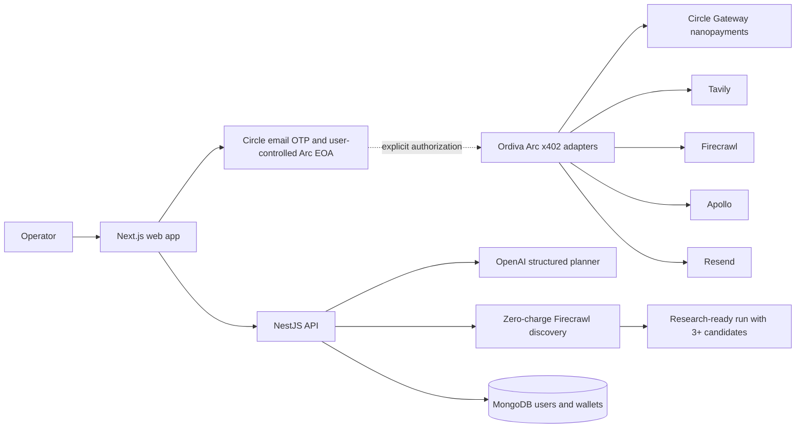

# Ordiva

> Your agent spends well, and you can see why.

Ordiva is an agentic supplier-sourcing platform built for the **Agentic Economy** track of the Arc Hackathon. A user gives the agent a real-world procurement goal and a USDC budget. Ordiva plans the work, discovers supplier candidates, decides what evidence is worth buying, and exposes the reason, policy result, price, and receipt behind every paid service call.

The central idea is simple: **the model provides judgment; deterministic code controls authority**.

## The problem

AI agents can search, reason, and recommend, but purchasing data safely is still unresolved.

A sourcing operator normally has to coordinate search providers, website scrapers, company-enrichment services, contact discovery, and email tools. Giving an LLM unrestricted access to those services creates a different problem: fetched content is untrusted, costs are difficult to explain, and a prompt-injected model must never be able to move funds by itself.

Circle already provides the wallet and static controls. Ordiva adds the missing buying layer:

- which service is worth paying for;
- whether the returned evidence is useful;
- when to retry, switch providers, or stop;
- whether the remaining budget is worth spending;
- and a human-readable record of every economic decision.

## The demo

The primary demonstration goal is:

> Find at least three industrial-pump suppliers in Rotterdam, verify that they are real companies, and prepare a request for quotation for each. Budget: 2 USDC.

The current run flow:

1. The user signs in with an email OTP through Circle.
2. Circle creates or returns one user-controlled EOA on Arc Testnet.
3. The user enters a sourcing outcome and service budget.
4. OpenAI generates a constrained, schema-validated research plan.
5. Ordiva automatically executes multiple Firecrawl discovery queries.
6. Results are normalized and deduplicated by supplier domain.
7. The run advances only when at least three distinct candidates are available.
8. The workbench shows the plan, queries, candidates, budget state, and next controlled action.

Initial public-web discovery is explicitly reported as a **zero-wallet-charge preview step**. Paid Arc verification and email delivery are not claimed until the corresponding authorization and receipt exist.

## Why this belongs in the Agentic Economy

Ordiva is not a chat wrapper around a search API. The product is shaped around economic decisions:

- the agent receives a goal rather than a single query;
- it decomposes that goal into research and evidence requirements;
- it chooses between paid capabilities with different prices and expected value;
- it operates inside a user-defined USDC budget;
- it can adapt when a provider fails or evidence is weak;
- and it must decide when the job is complete.

The LLM never authorizes payment. It recommends the next useful purchase; deterministic code validates the network, service, seller, schema, budget, and allowlist before any authorization can proceed.

## Why Arc

Agentic workloads create many small service purchases. Conventional onchain settlement is a poor fit when each API call may cost only a few cents or fractions of a cent.

Ordiva uses Arc Testnet and Circle Gateway nanopayments because the payment rail supports:

- USDC-native settlement;
- offchain EIP-3009 authorizations;
- gas-free individual service requests;
- batched onchain settlement;
- HTTP `402 Payment Required` negotiation;
- and receipts that can be associated with the agent's decision record.

Arc is not a decorative chain choice in Ordiva. It is the settlement network accepted by every x402 adapter route.

## Verified nanopayment proof

Before building the Ordiva adapter layer, the payment rail was validated against a real third-party QuickNode endpoint on Arc Testnet.

| Measurement | Result |
|---|---:|
| Gateway balance before | `$0.242806` |
| Gateway balance after | `$0.242706` |
| Exact balance delta | `$0.0001` |
| HTTP response | `200` |
| Payment round trip | `2,202 ms` |
| Settlement reference | returned by Circle Gateway |

The response contained a real RPC result. The balance debit and settlement reference confirmed that the purchase was authorized through Gateway rather than simulated in the UI.

## Architecture



There are two deliberately separate paths:

1. **The current run path** plans and performs zero-wallet-charge supplier discovery so the operator receives real candidates immediately.
2. **The paid service rail** exposes conventional APIs behind Arc-only x402 endpoints with pre-payment validation and normalized receipts.

The remaining bridge is an explicit Circle wallet signing flow that lets a user's own EOA purchase a paid verification from the Ordiva adapter rail. Ordiva does not use a shared platform buyer wallet.

## Judgment and authority

| Decision | Owner |
|---|---|
| Decompose the sourcing goal | LLM |
| Generate discovery and evidence requirements | LLM |
| Judge whether better evidence may be worth buying | LLM |
| Choose whether to retry, switch, or stop | LLM |
| Enforce the Arc network | Deterministic code |
| Enforce service and seller allowlists | Deterministic code |
| Enforce the budget and exact price | Deterministic code |
| Validate request and response schemas | Deterministic code |
| Authorize email recipients | Deterministic code plus explicit user approval |

Fetched pages are treated as evidence, never instructions. The model receives bounded content and returns constrained structured output.

## Arc x402 adapter catalog

Ordiva wraps conventional APIs in a consistent, discoverable payment interface.

### Core API surface

| Route | Purpose |
|---|---|
| `GET /healthz` | API and Arc-network health check |
| `GET /v1/auth/config` | Public Circle application and required wallet configuration |
| `POST /v1/auth/email/start` | Start the Circle email-OTP flow |
| `POST /v1/auth/session` | Validate the Circle user token and create an Ordiva session |
| `GET /v1/auth/me` | Return the authenticated user and public Arc wallet |
| `POST /v1/runs/plan` | Generate a plan and autonomously discover supplier candidates |
| `GET /v1/catalog` | Return the Arc adapter catalog, prices, availability, and schemas |

Account and sourcing routes are enabled only when their required environment variables are configured. The adapter catalog remains available so missing upstream configuration is visible rather than silently ignored.

### Paid adapter routes

| Route | Capability | Upstream | Default price |
|---|---|---|---:|
| `POST /v1/suppliers/tavily-search` | Supplier search | Tavily | `$0.01` |
| `POST /v1/suppliers/firecrawl-search` | Supplier search | Firecrawl | `$0.02` |
| `POST /v1/evidence/firecrawl-scrape` | Company evidence | Firecrawl | `$0.02` |
| `POST /v1/company/apollo-enrich` | Company enrichment | Apollo | `$0.03` |
| `POST /v1/contacts/firecrawl-extract` | Public contact discovery | Firecrawl | `$0.05` |
| `POST /v1/email/resend-send` | Allowlisted email delivery | Resend | `$0.01` |

`GET /v1/catalog` is free. It returns the network, seller address, configured availability, prices, and JSON Schemas for every adapter.

Paid adapter responses include:

- the disclosed upstream provider;
- verified payer, amount, network, and Gateway settlement reference;
- normalized response data;
- request latency;
- and a SHA-256 hash of the response.

Unavailable services, malformed inputs, unsafe scrape targets, and disallowed email recipients fail before the x402 payment middleware.

## Authentication and wallet model

Ordiva is a multi-user product. Each account is associated with exactly one Circle user-controlled EOA on `ARC-TESTNET`.

Authentication works as follows:

1. The browser initializes Circle's Web SDK.
2. The API requests an email OTP challenge.
3. Circle's secure UI verifies the OTP.
4. The API validates the returned Circle user token.
5. Circle returns or creates one Arc EOA for the user.
6. Ordiva issues its own application session.

Ordiva stores the Circle user ID and public wallet metadata. It does **not** store the OTP, Circle user token, encryption key, PIN, key shares, or private key.

Wallet ownership alone does not grant the backend signing authority. Paid agent execution requires an explicit signing or delegation boundary.

## Safety properties

- Arc Testnet is the only accepted x402 network.
- The model receives no payment or email tools.
- Request validation and safety preflight run before payment.
- Scraping rejects private, loopback, and local network targets.
- Email requires an exact recipient or domain allowlist.
- Resend requests require an idempotency key.
- A paid upstream failure retains its payment receipt.
- One wallet is enforced per user.
- Supplier candidates remain labeled unverified until evidence exists.
- The UI never claims payment, verification, settlement, or email delivery without proof.

## Technology

| Layer | Technology |
|---|---|
| Web | Next.js App Router, React, Tailwind CSS, Zustand |
| API | NestJS, TypeScript, Zod |
| Agent planning | OpenAI Responses API through the Vercel AI SDK |
| Authentication | Circle User-Controlled Wallets and email OTP |
| Payments | Arc Testnet, USDC, x402, Circle Gateway nanopayments |
| Persistence | MongoDB with Mongoose |
| Upstreams | Tavily, Firecrawl, Apollo, Resend |
| Tooling | pnpm workspaces, Vitest, ESLint |

## Repository

```text
ordiva/
├── api/                    NestJS API, agent orchestration, wallets and adapters
│   ├── src/
│   │   ├── adapters/       Arc x402 seller routes and conventional upstreams
│   │   ├── auth/           Circle email OTP and Ordiva sessions
│   │   ├── sourcing/       Planning and supplier discovery
│   │   ├── users/          User persistence
│   │   └── wallets/        One-wallet-per-user records
│   └── test/               API integration tests
├── web/                    Next.js operator interface
│   └── src/
│       ├── app/            App Router pages
│       ├── components/     Authentication, goal and run interfaces
│       └── lib/            API, session and run state
├── package.json            Workspace scripts
└── pnpm-workspace.yaml
```

Package-specific navigation:

- [API folder guide](./api/README.md)
- [Web folder guide](./web/README.md)

## Local development

### Prerequisites

- Node.js 22
- pnpm 10
- a MongoDB database
- Circle Developer credentials configured for User-Controlled Wallets
- an OpenAI API key
- at least a Firecrawl key for autonomous supplier discovery

Tavily, Apollo, and Resend are optional for running the initial discovery flow. Their adapter routes report unavailable before payment when their credentials are missing.

### Install

```bash
pnpm install
cp api/.env.example api/.env
```

Fill the required values in `api/.env`. Never commit that file.

### Run

Start the API:

```bash
pnpm dev:api
```

In another terminal, start the web app:

```bash
pnpm dev:web
```

Open `http://localhost:3000`. The web app proxies `/api/backend/*` to the API at `http://localhost:4100` by default.

To use a different API origin, set `ORDIVA_API_URL` for the web process.

## Environment variables

| Variable | Required for | Purpose |
|---|---|---|
| `MONGODB_URI` | Accounts | MongoDB connection |
| `AUTH_JWT_SECRET` | Accounts | Signs Ordiva sessions |
| `CIRCLE_API_KEY` | Accounts | Circle developer API access |
| `CIRCLE_APP_ID` | Accounts | Circle Web SDK application |
| `OPENAI_API_KEY` | Sourcing | Structured plan generation |
| `OPENAI_MODEL` | Optional | Overrides the configured OpenAI model |
| `FIRECRAWL_API_KEY` | Sourcing | Autonomous supplier discovery and evidence |
| `ARC_ADAPTER_SELLER_ADDRESS` | Adapters | Receives Arc Gateway nanopayments |
| `CIRCLE_GATEWAY_FACILITATOR_URL` | Adapters | Verifies Gateway payment authorizations |
| `TAVILY_API_KEY` | Optional adapter | Alternate supplier search |
| `APOLLO_API_KEY` | Optional adapter | Company enrichment |
| `RESEND_API_KEY` | Optional adapter | Email delivery |
| `RESEND_FROM_EMAIL` | Email | Verified sender identity |
| `EMAIL_ALLOWED_RECIPIENTS` | Email safety | Comma-separated exact recipients |
| `EMAIL_ALLOWED_DOMAINS` | Email safety | Comma-separated approved domains |
| `PRICE_*` | Adapter pricing | Per-route USDC prices such as `$0.02` |

See [`api/.env.example`](./api/.env.example) for the complete configuration contract.

## Commands

All JavaScript workspace operations use pnpm.

| Command | Purpose |
|---|---|
| `pnpm dev:api` | Start the NestJS API in watch mode |
| `pnpm dev:web` | Start the Next.js development server |
| `pnpm typecheck` | Type-check the API, tests, and web app |
| `pnpm lint` | Run API and web linting |
| `pnpm test` | Run the API test suite |
| `pnpm build` | Create production API and web builds |

## Verification status

The current repository passes:

- TypeScript type-checking;
- ESLint;
- 24 API integration tests;
- the NestJS production build;
- and the Next.js production build on Node.js 22.

The tests cover Circle authentication boundaries, one-wallet enforcement, adapter validation, Arc-only 402 challenges, normalized provider responses, supplier deduplication, the three-candidate gate, email allowlists, idempotency, and paid upstream failure receipts.

## Current MVP boundary

### Implemented

- Circle email-OTP accounts with one Arc EOA per user
- MongoDB user and public wallet records
- OpenAI structured sourcing plans
- autonomous multi-query Firecrawl discovery
- at least three deduplicated supplier candidates
- six Arc-only x402 seller routes
- pre-payment schemas and safety checks
- normalized results and payment receipts
- allowlisted, idempotent Resend adapter
- responsive operator workbench

### Next

- persist sourcing runs and enforce run ownership
- connect the user's Circle EOA to an explicit x402 buyer-signing flow
- purchase supplier verification through the Ordiva adapter rail
- store the decision, exact spend, evidence, and settlement receipt
- create run-connected email drafts and approval records
- send only after recipient-level approval

This boundary is intentional and visible in the product. Ordiva does not present zero-charge discovery as an onchain purchase, and it does not claim autonomous signing authority that has not been granted.

## License

This project was created for the Arc Hackathon. A production license has not yet been selected.
